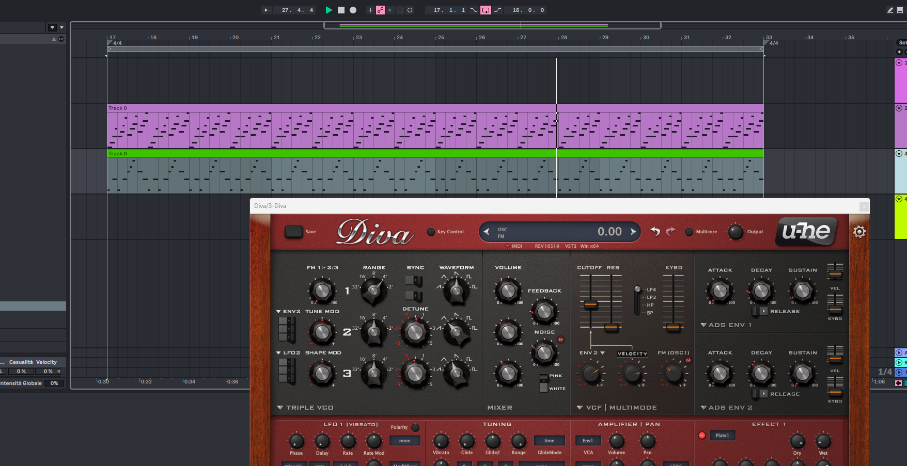

# CADENZA

<p align="center">
  
</p>

<p align="center">
  <a href="https://golang.org"></a>
  <a href="https://github.com/Andrea-Cavallo/cadenza/actions/workflows/ci.yml"></a>
  <a href="https://sonarcloud.io/summary/new_code?id=Andrea-Cavallo_cadenza"></a>
  <a href="https://sonarcloud.io/summary/new_code?id=Andrea-Cavallo_cadenza"></a>
  <a href="https://sonarcloud.io/summary/new_code?id=Andrea-Cavallo_cadenza"></a>
  <a href="https://sonarcloud.io/summary/new_code?id=Andrea-Cavallo_cadenza"></a>
  <a href="LICENSE"></a>
  
</p>

<p align="center">
  <strong>BPM + Key → 3 MIDI stems with LLM, 7 stems in offline mode. Under two seconds.</strong><br/>
  Harmonically coherent. Drop-in ready for any DAW — just import and assign instruments.
</p>

<p align="center">
  <a href="https://youtu.be/4RmFnDjGouc">
    
  </a>
  <br/>
  <em>Click to watch the demo on YouTube</em>
</p>

<p align="center">
  🎵 <a href="cadenza.mp3"><strong>Listen to the demo</strong></a> — generated with Cadenza, A minor 122 BPM, offline mode<br/>
  🎧 <a href="cadenza-2.mp3"><strong>Listen to a second preview</strong></a> — another Cadenza render
</p>

---

## Overview

Cadenza is a MIDI generator written in Go. Feed it BPM + key; it produces harmonically coherent MIDI stems rendered with deterministic timing, velocity, gate, and automation rules tuned for progressive house and melodic techno.

**LLM mode** (Claude, Ollama, OpenAI, Gemini) generates 3 stems — bassline, arpeggio, melody. The LLM creates musical motifs; the renderer applies professional articulation. Import the 3 `.mid` files into any DAW, assign a bass synth, an arp/pad, and a lead, and you have a complete sketch.

**Offline mode** (`--no-llm` with StyleFamily `groove` / `rolling` / `sub`) generates 7 stems — bassline-groove, bassline-rolling, bassline-sub, arpeggio, melody, chord-pad, and lead-stab — all locked to the same chord progression. This mode runs purely algorithmic: zero API calls, zero network, zero cost.

The same engine powers a CLI and a native desktop app (Wails v2) with a built-in piano-roll preview and per-stem download panel. Build scripts (`scripts/build-distributions.ps1` / `.sh`) package everything into standalone `.zip` files for Windows, macOS, and Linux.

---

## Offline Mode — 7-Stem Bundle

In offline mode with a **StyleFamily** selected (`groove`, `rolling`, or `sub`), Cadenza generates seven MIDI files on separate channels — all derived from the same shared chord progression:

| Stem | Channel | Role | Density |
|------|---------|------|---------|
| `bassline-groove.mid` | CH 1 | Rhythmic foundation — syncopated groove | 8–13 / 16 steps |
| `bassline-rolling.mid` | CH 2 | Acid / TB-303 pulse — near-full density | 14–16 / 16 steps |
| `bassline-sub.mid` | CH 3 | Deep sub — sparse, legato holds | 4–6 / 16 steps |
| `arp.mid` | CH 4 | Chord arpeggio — melodic movement | 48–64 / 64 steps |
| `melody.mid` | CH 5 | Lead melody — phrased motifs | 4–10 / 16 steps |
| `chord-pad.mid` | CH 6 | Harmonic sustain — drop-2 voicings | 2–6 / 16 steps |
| `lead.mid` | CH 7 | Staccato stab — percussive lead | 1–8 / 16 steps |

**LLM mode generates the core 3:** `bassline`, `arpeggio`, `melody` — the other 4 stems are exclusive to offline mode for now.

StyleFamily drives density, articulation, and voicing coherently across all layers from a single selector: `groove` (driving, club-ready), `rolling` (acid, hypnotic pulse), `sub` (deep, sparse, atmospheric).

### How the offline algorithm works

The offline engine is **seed-based and purely deterministic** — same seed + key + BPM always produces identical output. Here's what happens under the hood:

1. **Seed → hash → palette.** The seed is SHA-256 hashed with the key, scale, and pattern type. The resulting bytes index into a library of rhythmic templates, groove palettes, and contour shapes unique to each pattern type.
2. **Per-stem templates.** Each of the 7 stems has its own generation logic: basslines use 16 sub-patterns across 3 families (groove/rolling/sub), arpeggios cycle through 6 distinct patterns (ascending, pendulum, broken, etc.), melodies use a contour-based phrase builder (arch, question-answer, tension-hold) with controlled contrary motion, and chord pads use drop-2 voicings adapted to the selected StyleFamily.
3. **Post-processing.** All stems go through style-based articulation (velocity, gate, accent grids), minimum density enforcement, and the shared chord progression validator — ensuring every 4-bar section contains chord tones.
4. **Renderer.** The deterministic renderer applies timing offsets, velocity grids, CC automation (filter sweep, portamento), and DynamicCurve shaping — all tuned for progressive house / melodic techno.

In short: the seed determines **what** is played, the StyleFamily determines **how** it's articulated, and the renderer makes it **sound professional** — all without touching the network.

---

## Key Capabilities

- **Fully offline** — `--no-llm` is a first-class mode, not a fallback. Zero API calls, deterministic output, CI-friendly.
- **Harmonic coherence** — all stems share one chord progression; the validator enforces scale membership, range, density, and chord-tone ratios per section.
- **Modal scale support** — Natural Minor, Major, Dorian, Phrygian, Mixolydian, Lydian are all equal citizens.
- **Seed reproducibility** — every run prints a reproduce command. Same seed + key + BPM → identical output, always.
- **LLM creativity on demand** — Claude (`tool_use`), Ollama (JSON schema), OpenAI, and Gemini. Retry with targeted correction prompts; 30-day SHA256-keyed disk cache.
- **Genre presets** — `--preset progressive-warmup|peak-time-driver|afterhours-hypnotic|festival-melodic` pre-configure BPM, key, groove, and style.
- **Post-run iteration** — same harmony, new motifs; regenerate one stem; A/B compare; faster / slower / busier / sparser without re-entering the flow.
- **Static binaries** — `CGO_ENABLED=0`; cross-compile for Linux, macOS, and Windows from one machine.

---

## Modes at a Glance

| Mode | Stems | Network | API key | How it works |
|------|-------|---------|---------|--------------|
| **Offline** | 7 (with StyleFamily) | No | No | Algorithmic, deterministic, < 2 s |
| **Claude** | 3 (bass, arp, melody) | Yes | Yes | Structured output via `tool_use`; highest musical quality |
| **Ollama** | 3 (bass, arp, melody) | No (post-pull) | No | Local LLM — privacy-first, no cost after model download |
| **OpenAI** | 3 (bass, arp, melody) | Yes | Yes | Structured output mode |
| **Gemini** | 3 (bass, arp, melody) | Yes | Yes | JSON mode |

> **Note:** LLM providers generate 3 stems. You import those into your DAW as a starting point — assign a bass synth, an arp/pad, and a lead instrument. The 7-stem offline bundle adds dedicated rolling bass, sub bass, chord pad, and lead stab layers.

---

## Generate Standalone Applications

Cadenza ships with **build scripts** (`build-distributions.ps1` for Windows, `build-distributions.sh` for macOS/Linux) that produce ready-to-distribute standalone packages. Each package is a self-contained `.zip` file with no external dependencies — just unzip and run.

### What the build scripts produce

Run the script and you get three zip packages in `dist/`:

| Package | Contents |
|---------|----------|
| `cadenza-{version}-windows-amd64.zip` | `cadenza.exe` (CLI) + optional `desktop/Cadenza.exe` |
| `cadenza-{version}-macos-universal.zip` | `cadenza-darwin-amd64` + `cadenza-darwin-arm64` (CLI) + optional desktop `.app` bundle |
| `cadenza-{version}-linux-amd64.zip` | `cadenza` (CLI) + optional desktop binary |

Each zip also includes the README, LICENSE, and a `DISTRIBUTION.txt` with quick-start instructions.

### How to build

**Requirements:** Go 1.25, Git. Optional: Wails CLI + Node.js (for the desktop app).

#### Windows

```powershell
git clone https://github.com/Andrea-Cavallo/cadenza
cd cadenza
pwsh -NoProfile -ExecutionPolicy Bypass -File scripts/build-distributions.ps1
```

The packages land in `dist/`. To skip the desktop app (CLI only):

```powershell
pwsh -NoProfile -ExecutionPolicy Bypass -File scripts/build-distributions.ps1 -SkipDesktop
```

#### macOS / Linux

```bash
git clone https://github.com/Andrea-Cavallo/cadenza
cd cadenza
bash scripts/build-distributions.sh
```

The packages land in `dist/`. To skip the desktop app (CLI only):

```bash
bash scripts/build-distributions.sh --skip-desktop
```

#### Build options

| Flag | Description |
|------|-------------|
| `--version <v>` / `-Version <v>` | Release label (default: auto-detected from `git describe`) |
| `--output-dir <dir>` / `-OutputDir <dir>` | Destination directory (default: `./dist`) |
| `--skip-desktop` / `-SkipDesktop` | Package CLI binaries only, skip the desktop app |
| `--skip-checks` / `-SkipChecks` | Skip `go test ./...` before building |
| `--clean` / `-Clean` | Remove `dist/` before packaging |

Each package is self-contained: unzip it, run the `cadenza` binary, and the output appears in `./output/`.

---

## Desktop App

The desktop app is a Wails v2 shell around the same Go engine. It runs natively on Windows, macOS, and Linux; the React UI calls Go methods directly with no HTTP layer in between. It is built automatically by the distribution scripts when Wails is available, or can be built manually:

```bash
cd backend
make desktop-dev      # live Wails dev mode (hot reload)
make desktop          # production Windows build
make desktop-manual   # npm install + Vite build + Go production compile
```

**Features:**
- Provider panel — detects API keys, checks Ollama availability, lists installed local models
- StyleFamily selector (`Groove` / `Rolling` / `Sub`) replaces the old flavor dropdown in offline mode
- Per-stem piano-roll preview with tabbed navigation across all seven stems
- Download panel with individual stem buttons and click-to-open-folder
- Quick-action regen buttons per stem (Bass, Arp, Mel, Pad, Lead, A/B) — same harmony, new motif

---

## LLM Providers

Once you have the standalone binary from a distribution package, Cadenza can use any of these LLM backends by setting the appropriate environment variable and running the binary with the `--provider` and `--model` flags.

### Provider reference

| Provider | Env variable | Default model | Notes |
|----------|-------------|---------------|-------|
| **Claude** (default) | `ANTHROPIC_API_KEY` | — | Structured output via `tool_use`; highest musical quality |
| **OpenAI** | `OPENAI_API_KEY` | — | Structured output mode |
| **Gemini** | `GEMINI_API_KEY` | — | JSON mode |
| **Ollama** | none (local) | — | Local LLM — privacy-first, no cost after one-time model download |

A 30-day SHA256-keyed disk cache skips repeated API calls for identical inputs. If any LLM fails after retries, Cadenza falls back silently to the offline algorithmic engine — generation never aborts.

### Ollama — Local LLM (no API key, no internet after setup)

Ollama runs entirely on-device with full privacy. After the one-time model download you can use `--provider ollama` with zero network traffic.

The screenshots below are real output generated with **DeepSeek** running locally via Ollama:

<p align="center">
  <br/>
  <em>Bass groove stem — Ollama + DeepSeek (local, no API key)</em>
</p>

<p align="center">
  <br/>
  <em>Arpeggio stem — Ollama + DeepSeek (local, no API key)</em>
</p>

<p align="center">
  <br/>
  <em>Melody stem — Ollama + DeepSeek (local, no API key)</em>
</p>

**Step 1 — Install Ollama**

- **macOS:** Download from `https://ollama.com/download` (`.dmg`), or `brew install ollama`. The menu-bar icon starts the server automatically on `http://localhost:11434`.
- **Windows:** Download and run `OllamaSetup.exe` from `https://ollama.com/download`. The service starts automatically on `http://localhost:11434`.
- **Linux:** `curl -fsSL https://ollama.com/install.sh | sh`

**Step 2 — Download a model (one-time, ~2–8 GB)**

| Model | Size | Notes |
|-------|------|-------|
| `gemma` | ~5 GB | Best balance of speed and musical output (recommended) |
| `qwen2.5:7b` | ~5 GB | Strong JSON schema compliance |
| `llama3.2` | ~2 GB | Fastest on CPU-only machines |
| `mistral` | ~4 GB | Good fallback if others are slow |

Run `ollama pull <model>` for any of the above. Verify with `ollama list`.

**Step 3 — Set the provider flag when running the binary**

Pass `--provider ollama --model <name>` to the `cadenza` binary from your distribution package. The app auto-detects the Ollama server at `http://localhost:11434`.

> **Performance tip:** Ollama runs faster with a GPU. On CPU-only machines use `llama3.2` or `mistral` for lower latency (typically 5–30 s).

---

## DAW Preview

Import the generated MIDI stems directly into your DAW — Ableton Live, FL Studio, Logic Pro, or any other. LLM mode gives you 3 essential layers (bass, arp, melody); offline mode fills all 7 channels. No editing required; they are already harmonically locked to a shared chord progression.

<p align="center">
  <br/>
  <em>Seven MIDI stems imported into Ableton Live — bass groove, rolling, sub, arp, melody, chord pad, lead stab</em>
</p>

---

## Producer Workflow

```
1.  Run the cadenza binary with your BPM and key.
    --no-llm + StyleFamily → 7 stems. LLM mode → 3 stems (bass, arp, melody).

2.  Import the generated .mid files into your DAW — Ableton, FL Studio, Logic, whatever.
    Assign instruments: sub synth, bass, acid line, pad, arp, lead, stab.

3.  Cadenza prints a Reproduce command — save it to recreate the exact session later.
    Same seed + key + BPM = identical output, always.
```

---

## Architecture

```
User (BPM + Key + StyleFamily)
  → Key parser
  → Chord progression (4 chords, shared across all stems)
  → LLM mode: 3 parallel generators (bassline, arpeggio, melody)
  → Offline mode: 7 parallel generators (groove, rolling, sub, arp, melody, pad, lead)
  → Validator (scale · range · density · chord coherence per section)
  → StyleProfile → Renderer (timing · velocity · gate · CC automation · portamento)
  → 3 or 7 MIDI Type-0 files
```

The LLM owns motif creativity. The offline engine owns everything algorithmically. The renderer owns all timing and dynamics. The validator enforces musical invariants. StyleFamily drives offline articulation coherently across all seven layers with zero extra latency.

---

## Useful Commands

```bash
make distributions   # build standalone packages for all platforms (Windows/macOS/Linux)
make build           # compile CLI for current platform only
make build-all       # cross-compile CLI binaries for all platforms
make test            # unit tests
make test-race       # race-detector pass
make test-coverage   # coverage report
make ci              # full local CI: fmt → vet → lint → vuln → coverage
```

---

## Beta

Cadenza is in **beta**. The CLI and desktop app are actively used for sketching and production iteration, but prompts, presets, and musical defaults may still evolve between releases.

Application logs are written to `<output-dir>/logs/cadenza.log` (default: `backend/output/logs/cadenza.log`).

---

## Italiano

Cadenza trasforma BPM e tonalità in stem MIDI armonicamente coerenti. In **modalità LLM** genera 3 stem (bassline, arpeggio, melodia) da importare direttamente in qualsiasi DAW. In **modalità offline** con StyleFamily (`groove` / `rolling` / `sub`) genera 7 stem: bassline groove, bassline rolling, bassline sub, arpeggio, melodia, chord pad e lead stab — tutti deterministici e riproducibili per seed, senza chiamate API.

L'algoritmo offline usa seed → hash SHA-256 → palette ritmiche e contour melodici specifici per ogni tipo di stem: 16 sotto-pattern per i bassi, 6 pattern di arpeggio, costruttore di frasi melodiche basato su contour (arch, question-answer, tension-hold), voicing drop-2 per i pad. Il renderer deterministico applica velocity, timing, gate, CC automation e curve dinamiche.

Per generare l'applicazione standalone e i pacchetti di distribuzione, esegui lo script di build:

- **Windows:** `pwsh -NoProfile -ExecutionPolicy Bypass -File scripts/build-distributions.ps1`
- **macOS / Linux:** `bash scripts/build-distributions.sh`

I pacchetti `.zip` pronti per la distribuzione vengono creati nella cartella `dist/`.

---

## Español

Cadenza convierte BPM y tonalidad en stems MIDI armónicamente coherentes. En **modo LLM** genera 3 stems (bassline, arpegio, melodía) para importar directamente en cualquier DAW. En **modo offline** con StyleFamily (`groove` / `rolling` / `sub`) genera 7 stems: bassline groove, bassline rolling, bassline sub, arpegio, melodía, chord pad y lead stab — todos deterministas y reproducibles por seed, sin llamadas API.

El algoritmo offline usa seed → hash SHA-256 → paletas rítmicas y contornos melódicos específicos para cada tipo de stem: 16 sub-patrones para bajos, 6 patrones de arpegio, constructor de frases melódicas basado en contorno (arch, question-answer, tension-hold), voicing drop-2 para pads. El renderer determinista aplica velocity, timing, gate, CC automation y curvas dinámicas.

Para generar la aplicación independiente y los paquetes de distribución, ejecuta el script de build:

- **Windows:** `pwsh -NoProfile -ExecutionPolicy Bypass -File scripts/build-distributions.ps1`
- **macOS / Linux:** `bash scripts/build-distributions.sh`

Los paquetes `.zip` listos para distribuir se crean en la carpeta `dist/`.

---

## Repository Notes

| Property | Value |
|----------|-------|
| Go version | 1.25 |
| Module path | `github.com/Andrea-Cavallo/cadenza` |
| CLI entry point | `./cmd/cadenza/` |
| Desktop entry point | `./cmd/desktop/` |
| Default output | `./output/` |
| CGO | disabled |
| Offline mode | first-class, not degraded |
