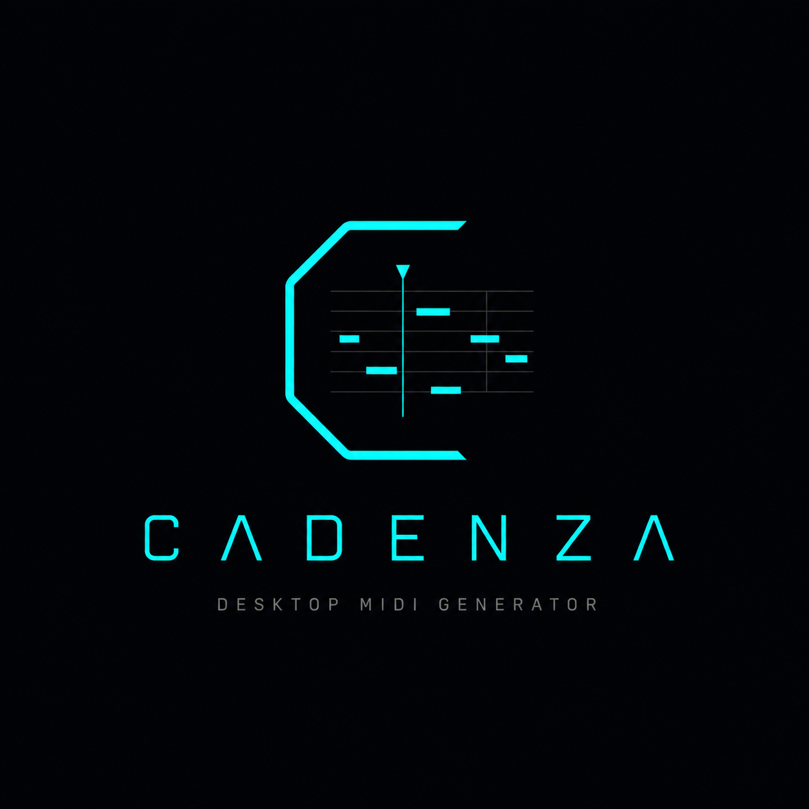
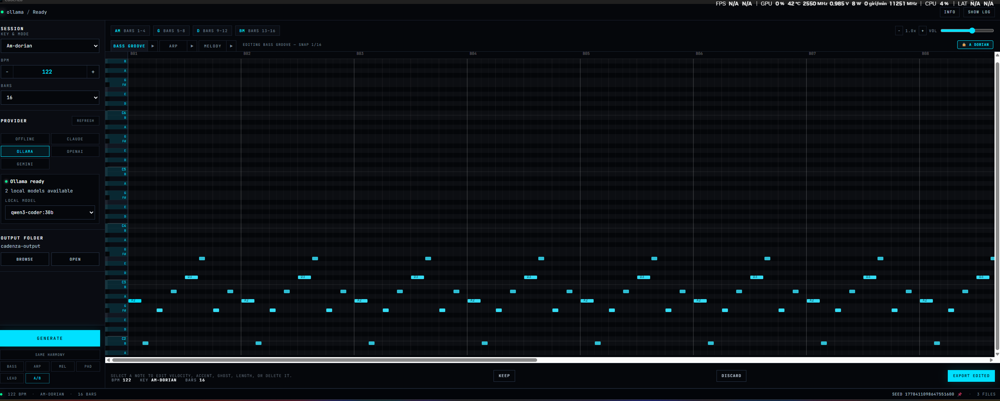
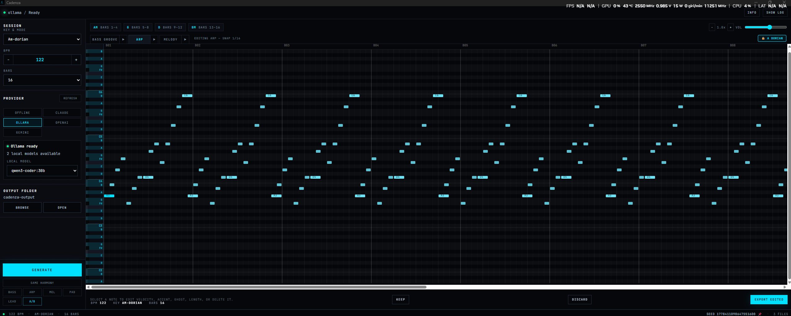
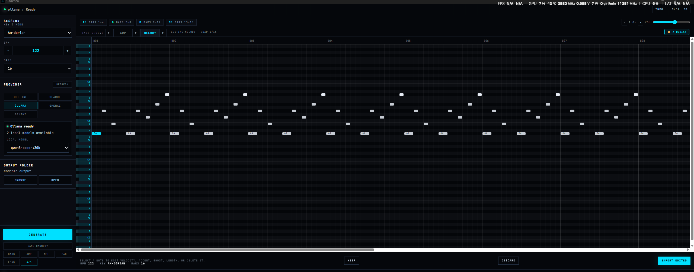

# CADENZA

<p align="center">
  
</p>

<p align="center">
  <a href="https://golang.org"></a>
  <a href="https://github.com/Andrea-Cavallo/cadenza/actions/workflows/ci.yml"></a>
  <a href="https://sonarcloud.io/summary/new_code?id=Andrea-Cavallo_cadenza"></a>
  <a href="https://sonarcloud.io/summary/new_code?id=Andrea-Cavallo_cadenza"></a>
  <a href="https://sonarcloud.io/summary/new_code?id=Andrea-Cavallo_cadenza"></a>
  <a href="https://sonarcloud.io/summary/new_code?id=Andrea-Cavallo_cadenza"></a>
  <a href="LICENSE"></a>
  
</p>

<p align="center">
  <strong>BPM + Key → 7 production-ready MIDI stems, in under two seconds.</strong><br/>
  Offline. Harmonically coherent. Drop-in ready for any DAW.
</p>

---

## Overview

Cadenza is an AI-powered MIDI generator written in Go. Feed it a tempo and a key; it produces a complete seven-stem bundle — bass groove, rolling bass, sub bass, arpeggio, melody, chord pad, and lead stab — all sharing the same chord progression and rendered with deterministic timing, velocity, gate, and automation rules tuned for progressive house and melodic techno.

The engine runs entirely offline by default. No API call, no network, no cost. When you do want LLM creativity, Claude, Ollama, OpenAI, and Gemini are all supported with a single flag. If an LLM fails, the engine falls back to the offline templates silently — generation never aborts.

The same engine powers a CLI, an HTTP API server, and a native desktop app (Wails v2) with a built-in piano-roll preview and per-stem download panel.

---

## 7-Stem Bundle

Every `Generate` call produces seven MIDI files on separate channels, all derived from the same shared chord progression and style family:

| Stem | Channel | Role | Offline density |
|------|---------|------|----------------|
| `bassline-groove.mid` | CH 1 | Rhythmic foundation — syncopated groove | 8 – 13 / 16 steps |
| `bassline-rolling.mid` | CH 2 | Acid / TB-303 pulse — near-full density | 14 – 16 / 16 steps |
| `bassline-sub.mid` | CH 3 | Deep sub — sparse, legato holds | 4 – 6 / 16 steps |
| `arp.mid` | CH 4 | Chord arpeggio — melodic movement | 48 – 64 / 64 steps |
| `melody.mid` | CH 5 | Lead melody — phrased motifs | 4 – 10 / 16 steps |
| `chord-pad.mid` | CH 6 | Harmonic sustain — drop-2 voicings | 2 – 6 / 16 steps |
| `lead.mid` | CH 7 | Staccato stab — percussive lead | 1 – 8 / 16 steps |

A **StyleFamily** (`groove` / `rolling` / `sub`) drives density, articulation, and voicing coherently across all seven layers from a single selector.

---

## Key Capabilities

- **Fully offline** — `--no-llm` is a first-class mode, not a fallback. Zero API calls, deterministic output, CI-friendly.
- **Harmonic coherence** — all stems share one chord progression; the validator enforces scale membership, range, density, and chord-tone ratios per section.
- **Modal scale support** — Natural Minor, Major, Dorian, Phrygian, Mixolydian, Lydian are all equal citizens.
- **Seed reproducibility** — every run prints a reproduce command. Same seed + key + BPM → identical output, always.
- **LLM creativity on demand** — Claude (`tool_use`), Ollama (JSON schema), OpenAI, and Gemini. Retry with targeted correction prompts; 30-day SHA256-keyed disk cache.
- **Genre presets** — `--preset progressive-warmup|peak-time-driver|afterhours-hypnotic|festival-melodic` pre-configure BPM, key, groove, and style.
- **Post-run iteration** — same harmony, new motifs; regenerate one stem; A/B compare; faster / slower / busier / sparser without re-entering the flow.
- **Static binaries** — `CGO_ENABLED=0`; cross-compile for Linux, macOS, and Windows from one machine.

---

## Modes at a Glance

| Mode | Network | API key | Characteristics |
|------|---------|---------|----------------|
| **Offline** | No | No | Algorithmic, deterministic, < 2 s, excellent for production starters |
| **Claude** | Yes | Yes | Structured output via `tool_use`; highest musical quality |
| **Ollama** | No (post-pull) | No | Local LLM — privacy-first, no cost after model download |
| **OpenAI** | Yes | Yes | Structured output mode |
| **Gemini** | Yes | Yes | JSON mode |

---

## Quick Start

```bash
# Install the CLI
go install github.com/Andrea-Cavallo/cadenza/cmd/cadenza@latest

# Generate immediately — no API key required
cadenza --bpm 122 --key Am --no-llm
```

Or run directly from the cloned repo:

```bash
cd backend
go run ./cmd/cadenza/ --bpm 122 --key Am --no-llm
```

Output goes to `./output/` by default. Seven `.mid` files appear in about one second.

---

## Desktop App

The desktop app is a Wails v2 shell around the same Go engine. It runs natively on Windows, macOS, and Linux; the React UI calls Go methods directly with no HTTP layer in between.

**Features:**
- Provider panel — detects API keys, checks Ollama availability, lists installed local models
- StyleFamily selector (`Groove` / `Rolling` / `Sub`) replaces the old flavor dropdown in offline mode
- Per-stem piano-roll preview with tabbed navigation across all seven stems
- Download panel with individual stem buttons and click-to-open-folder
- Quick-action regen buttons per stem (Bass, Arp, Mel, Pad, Lead, A/B) — same harmony, new motif

```bash
cd backend
make desktop-dev      # live Wails dev mode (hot reload)
make desktop          # production Windows build
make desktop-manual   # npm install + Vite build + Go production compile
```

---

## Build from Source

**Requirements:** Go 1.25, Git. Optional: `make`, Wails CLI + Node.js for the desktop app.

#### Windows (PowerShell)

```powershell
git clone https://github.com/Andrea-Cavallo/cadenza
cd cadenza/backend
go build -o bin/cadenza.exe ./cmd/cadenza/
.\bin\cadenza.exe --bpm 122 --key Am --no-llm
```

#### macOS / Linux

```bash
git clone https://github.com/Andrea-Cavallo/cadenza
cd cadenza/backend
go build -o bin/cadenza ./cmd/cadenza/
./bin/cadenza --bpm 122 --key Am --no-llm
```

#### Cross-compile all platforms

```bash
make build-all
```

Produces `bin/cadenza-{linux,darwin,windows}-{amd64,arm64}` in one pass.

---

## Run with LLMs

#### Claude

```bash
export ANTHROPIC_API_KEY=sk-ant-...
./bin/cadenza --bpm 122 --key Am
```

```powershell
$env:ANTHROPIC_API_KEY="sk-ant-..."
.\bin\cadenza.exe --bpm 122 --key Am
```

#### OpenAI

```bash
export OPENAI_API_KEY=sk-...
./bin/cadenza --bpm 124 --key Em --provider openai
```

#### Gemini

```bash
export GEMINI_API_KEY=...
./bin/cadenza --bpm 128 --key Dm --provider gemini
```

#### Ollama

Run entirely on-device — no API key, no internet, full privacy. The example below was generated with **Gemma** running locally via Ollama.

<p align="center">
  <br/>
  <em>Bass groove stem — Ollama + Gemma</em>
</p>

<p align="center">
  <br/>
  <em>Arpeggio stem — Ollama + Gemma</em>
</p>

<p align="center">
  <br/>
  <em>Melody stem — Ollama + Gemma</em>
</p>

```bash
ollama pull gemma        # one-time model download
ollama serve
./bin/cadenza --bpm 126 --key Fm --provider ollama --model gemma
```

---

## Producer Workflow

```
1.  cadenza                               # interactive mode
    → pick a genre preset, or set BPM/key/style manually
    → confirm and render

2.  Import all 7 MIDI stems into your DAW at the printed BPM.
    Assign instruments: sub synth, bass, acid line, pad, arp, lead, stab.

3.  Iterate in the terminal without leaving the session:
    [3] Same harmony, new motifs          # fresh motifs, same chord progression
    [5] Faster (+6 BPM)                   # nudge energy up
    [4] A/B compare                       # two variations in A/ and B/ folders

4.  Copy the Reproduce line from the output to recreate the exact session later.
```

---

## Architecture

```
User (BPM + Key + StyleFamily)
  → Key parser
  → Chord progression (4 chords, shared across all stems)
  → Parallel generators × 7:
      bassline-groove · bassline-rolling · bassline-sub
      arpeggio · melody · chord-pad · lead-stab
  → Validator (scale · range · density · chord coherence per section)
  → StyleProfile → Renderer (timing · velocity · gate · CC automation · portamento)
  → 7 MIDI Type-0 files
```

The LLM owns motif creativity. The renderer owns all timing and dynamics. The validator enforces musical invariants. StyleFamily drives offline articulation coherently across all seven layers with zero extra latency.

---

## Useful Commands

```bash
make build          # compile CLI for current platform
make build-all      # cross-compile all platforms
make test           # unit tests
make test-race      # race-detector pass
make test-coverage  # coverage report
make ci             # full local CI: fmt → vet → lint → vuln → coverage
```

---

## Beta

Cadenza is in **beta**. The CLI and desktop app are actively used for sketching and production iteration, but prompts, presets, and musical defaults may still evolve between releases.

Application logs are written to `<output-dir>/logs/cadenza.log` (default: `backend/output/logs/cadenza.log`).

---

## Italiano

Cadenza trasforma BPM e tonalità in sette stem MIDI: bassline groove, bassline rolling, bassline sub, arpeggio, melodia, chord pad e lead stab. Tutti condividono la stessa progressione armonica e il parametro **StyleFamily** (`groove` / `rolling` / `sub`) calibra densità e articolazione di ogni layer in modo coerente.

La modalità offline (`--no-llm`) è un punto di forza del progetto, non un ripiego: genera pattern ipnotici e musicalmente utili senza chiamate API, con risultati deterministici e riproducibili per seed.

```bash
cd backend && go run ./cmd/cadenza/ --bpm 122 --key Am --no-llm
```

---

## Español

Cadenza convierte BPM y tonalidad en siete stems MIDI: bassline groove, bassline rolling, bassline sub, arpegio, melodía, chord pad y lead stab. Todos comparten la misma progresión armónica; el parámetro **StyleFamily** (`groove` / `rolling` / `sub`) coordina densidad y articulación de cada capa de forma coherente.

El modo offline (`--no-llm`) es una fortaleza real del proyecto: genera patrones hipnóticos y musicalmente útiles sin llamadas API, con resultados deterministas y reproducibles por seed.

```bash
cd backend && go run ./cmd/cadenza/ --bpm 122 --key Am --no-llm
```

---

## Repository Notes

| Property | Value |
|----------|-------|
| Go version | 1.25 |
| Module path | `github.com/Andrea-Cavallo/cadenza` |
| CLI entry point | `./cmd/cadenza/` |
| Desktop entry point | `./cmd/desktop/` |
| Default output | `./output/` |
| CGO | disabled |
| Offline mode | first-class, not degraded |
